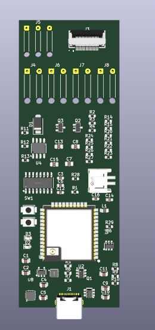
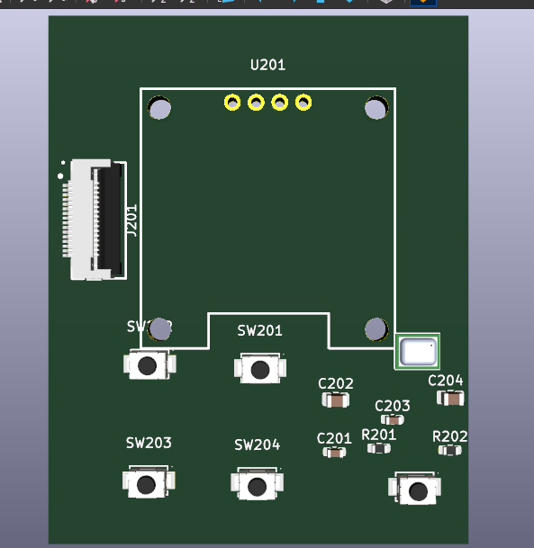

# Custom PCB Fabrication

This folder is for the custom PCB version of the ESP32 ESP-NOW walkie-talkie. The goal is to avoid the hassle of soldering a large number of individual wires between breakout boards by fabricating a purpose-built PCB and, optionally, having JLCPCB assemble the surface-mount parts.

The PCB does not eliminate every hand-soldered part. It mainly replaces the messy internal wiring and small breakout-module interconnects.

## PCB Preview

Main board:

Front/user-interface board:

## Why Use a Custom PCB?

- Cleaner internal assembly inside the 3D printed casing
- Fewer loose wires and fewer wiring mistakes
- Better reliability after drops, vibration, or battery changes
- Easier repeat builds once the board files are verified
- Cleaner routing for power, audio, buttons, display, and ESP32 signals

## Expected JLCPCB Cost

JLCPCB's prototype PCB pricing changes with board size, layer count, color, shipping, coupons, and assembly choices. As of July 2026, JLCPCB advertises prototype PCB fabrication starting around **$2 for 5 bare PCBs** before shipping and selected options.

If you want JLCPCB to assemble parts onto the board, the final price is quote-based. It depends on:

- Number of boards
- One-sided or two-sided assembly
- Number of solder joints
- Basic vs Extended JLCPCB parts
- Component stock and component price
- Shipping method

Use JLCPCB's online quote as the final source of price before ordering.

Useful links:

- [JLCPCB PCB prototype service](https://jlcpcb.com/features/pcb-prototype)
- [JLCPCB online quote](https://cart.jlcpcb.com/quote/)
- [JLCPCB PCB assembly FAQ](https://jlcpcb.com/help/article/pcb-assembly-faqs)

## What You Upload to JLCPCB

For bare PCB fabrication, upload:

- Gerber ZIP exported from KiCad
- Drill files, usually included in the Gerber ZIP

For PCB assembly, also upload:

- BOM CSV
- CPL / pick-and-place CSV
- Correct JLCPCB/LCSC part numbers for all assembled components

Before ordering, inspect the online Gerber viewer carefully. Check that the board outline, holes, USB-C opening alignment, mounting holes, and connector locations match the 3D printed casing.

## Parts JLCPCB Can Usually Assemble

The custom PCB should use JLCPCB/LCSC parts for the small surface-mount electronics when possible:

- ESP32 module
- USB-C connector
- USB-to-UART chip
- Battery charging/protection ICs
- Voltage regulator and inductor
- Audio amplifier
- SMD resistors and capacitors
- FFC connector
- SMD LEDs or indicator parts, if included in the PCB design

Prefer JLCPCB Basic parts where possible. Extended parts are usable, but they usually add extra cost.

## Parts You Still Need to Buy and Solder Yourself

Even with a custom PCB, plan to source and hand-solder or mechanically install these parts:

- Face buttons
- Laser module
- 10K volume potentiometer
- OLED display
- Slim 3W speaker
- Battery
- Main power switch
- Any external antenna or antenna lead required by the ESP32 module
- Any wires needed between the PCB and casing-mounted parts

These parts are mechanical/user-facing parts, so their exact placement depends on the 3D printed casing. They should be checked against the casing before final PCB ordering.

## Recommended KiCad to JLCPCB Workflow

1. Open the KiCad project from the `.kicad_pro` file.
2. Run ERC in the schematic editor.
3. Confirm every schematic symbol has a footprint.
4. Add `LCSC` fields for parts that JLCPCB should assemble.
5. Update the PCB from the schematic.
6. Draw or import the exact board outline from the 3D casing.
7. Place casing-critical parts first: USB-C, buttons, OLED, speaker pads, potentiometer, laser pads, mounting holes, and connectors.
8. Route the PCB and run DRC until there are no real errors.
9. Export Gerbers, drill files, BOM, and CPL files.
10. Upload the files to JLCPCB and verify the Gerber/assembly preview before ordering.

## Fusion 360 Fit Check

Before ordering, export a STEP model from KiCad and import it into Fusion 360 with the 3D printed casing. Check:

- PCB outline fits inside the casing
- USB-C aligns with the casing opening
- OLED lines up with the display window
- Buttons line up with the button holes
- Speaker fits and has acoustic clearance
- Laser module aligns with its casing opening
- Potentiometer shaft/knob position is correct
- Battery and wiring have enough room

Do this fit check before paying for fabrication. A cheap PCB is still annoying if the USB port or buttons are off by a few millimeters.
