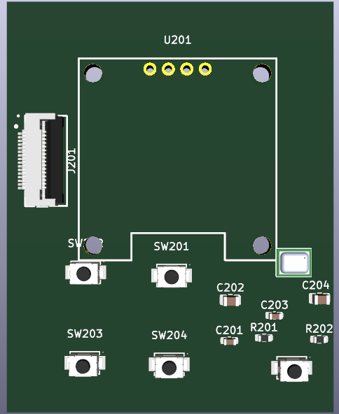

# Custom PCB Fabrication

This is a KiCad PCB for those looking to make the walkie talkie from PCBs. Note that you will still have to solder some components.

## PCB Preview

Main board:

Front/user-interface board:

## Risks

Although this custom PCB works, I will be manufactering a redesigned much cleaner version later that avoids the hassle of 2 PCB boards and does everything one one, with a much slimmer walkie talkie design.

## Manufacturer Files

In this folder are the source kicad files for the PCB and manufacterable GERBER files.

### Main PCB

- [Gerber/drill ZIP](MANUFACTOR%20FILES/MAIN%20PCB/WalkieTalkie_Main_Gerbers_Drill.zip)
- [JLCPCB BOM CSV](MANUFACTOR%20FILES/MAIN%20PCB/WalkieTalkie_Main_JLCPCB_BOM.csv)
- [JLCPCB CPL / position CSV](MANUFACTOR%20FILES/MAIN%20PCB/WalkieTalkie_Main_JLCPCB_CPL.csv)

### Front PCB

- [Gerber/drill ZIP](MANUFACTOR%20FILES/FRONT%20PCB/WalkieTalkie_Front_Gerbers_Drill.zip)
- [JLCPCB BOM CSV](MANUFACTOR%20FILES/FRONT%20PCB/WalkieTalkie_Front_JLCPCB_BOM.csv)
- [JLCPCB CPL / position CSV](MANUFACTOR%20FILES/FRONT%20PCB/WalkieTalkie_Front_JLCPCB_CPL.csv)

## Parts JLCPCB Can Usually Assemble

Most of the parts and SMD components should be assembled by JLBPCB but you will need to solder these parts:

- PTT Button
- Laser module
- 10K volume potentiometer
- OLED display
- Slim 3W speaker
- Battery
- Power switch

