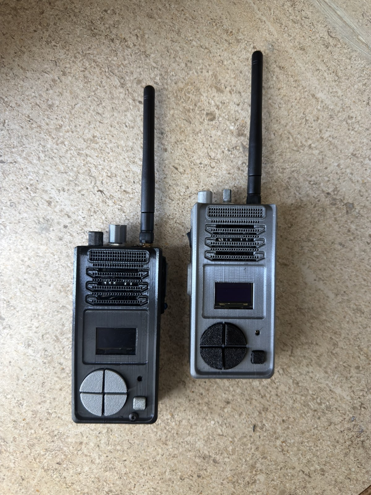
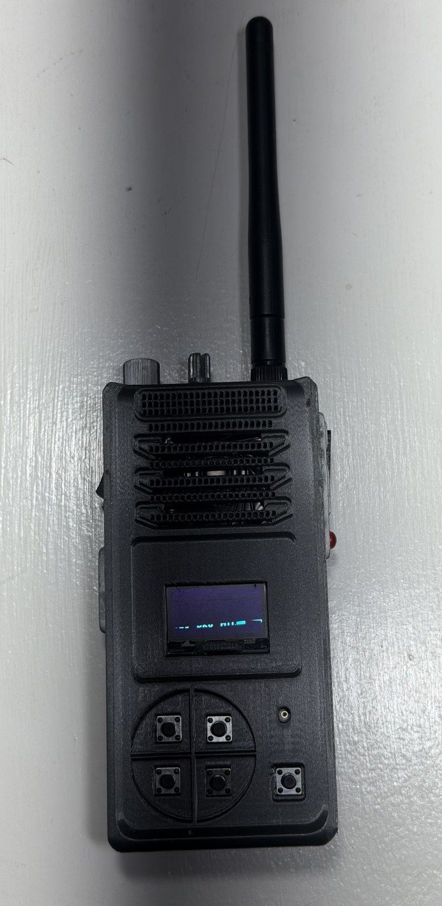

Source: 

<p align="center">
  
</p>


## Project Description


The current implementation utilizes the ESP32-U type of board with external antenna, OLED screen, I2S microphone, I2S speaker amplifier, volume potentiometer, GPIO buttons, laser and LED. The aim of this project is to create a compact two-way voice communicator with phone-like user interface, channel selection, link check, battery monitoring, lights control and experimental long-distance ESP-NOW voice radio.

### Features

* Peer-to-peer ESP-NOW voice communications without any router or access point.
* ESP32 with external antenna hardware for better distance compared with boards with PCB antenna.
* Configuration of ESP-NOW radio for long distance use with maximal ESP32 TX power and ESP32 LR PHY peer rate settings.
* Designed for up to 1 mile distance in line-of-sight in outdoor conditions, actual distance will depend heavily on antenna placement, interference, obstacles, body shielding and battery voltage.
* 16 kHz mono voice capture with IMA ADPCM compression, so each 20 ms of voice is captured and compressed in one ESP-NOW packet.
* Packet jitter buffer and packet loss concealment to reduce jitters when packets are received unevenly.
* Weak link redundancy which duplicates packets at distance with bad range and de-duplicates received packets to make range testing easier.
* Inbuilt flash range telemetry with JSON data collection to log range test without computer attached in the field.
* OLED interface for channels, link, signal, battery, volume, RX/PTT status, application menu, settings, lights control and kid mode.
* Firmware, wiring information, build pictures and CAD documentation to fork and evolve this project.

## More Than a Walkie Talkie

Despite being mostly a two-way voice communicator, this project can be used as a Wi-Fi/IoT device handheld controller platform. With buttons, display, audio hardware, ESP-NOW radio and regular Wi-Fi capability the same hardware can be re-purposed for controlling IoT/Wi-Fi devices.

This firmware supports an `RCAR` application to control an RC or tank drive train. Black walkie can operate two MG996-type continuous rotation servos via GPIO1 and GPIO3 pins. Grey walkie can serve as the handheld remote over ESP-NOW radio. Walkie enclosure turns out to be a handheld controller with integrated voice channel.

<p align="center">
  
</p>

## Walkie Talkie Hardware

I have used a custom 3D-printed walkie-talkie enclosure housing an ESP32 digital audio hardware system.

<p align="center">
  
  
</p>

### Main Electronics

* ESP32-U type development board with 240 MHz CPU, 4 MB flash memory, ~512 KB of internal SRAM, Wi-Fi, Bluetooth hardware and external antenna connection.
* OLED display for full interface.
* I2S digital microphone for voice input.
* I2S output feeding MAX9875A type speaker amplifier.
* Speaker included in 3D-printed enclosure.
* Volume potentiometer.
* Reclaimed 3.85 V lithium battery pack with capacity of about 2000 mAh.
* 6 GPIO push buttons for PTT, OK button, navigation and applications/settings.
* LED light for status and TX indication.
* Laser module operated on 3.3 V as manual output and part of lights app.
* Voltage divider to feed ADC pin for battery voltage measurement.


## Circuit Diagram

The high-level circuit diagram illustrates connections between ESP32, display, I2S audio devices, buttons, analog input, LED, laser, and battery measurement circuit.

<p align="center">
  
</p>

### Common Pin Assignment

| Function             | ESP32 GPIO | Comments                  |
| -------------------- | ---------: | ------------------------- |
| OLED SCL             |     GPIO18 | I2C clock                 |
| OLED SDA             |     GPIO19 | I2C data                  |
| Speaker BCLK         |     GPIO32 | I2S output bit clock      |
| Speaker WS/LRC       |     GPIO33 | I2S output word select    |
| Speaker DIN          |     GPIO25 | I2S output data           |
| Microphone BCLK      |     GPIO16 | I2S input bit clock       |
| Microphone WS        |     GPIO17 | I2S input word select     |
| Microphone SD        |      GPIO4 | I2S input data            |
| OK button            |      GPIO0 | Active low                |
| Bottom-left button   |     GPIO14 | Active low                |
| Bottom-right button  |     GPIO15 | Active low                |
| Laser                |     GPIO21 | 3.3 V laser module output |
| Volume potentiometer |     GPIO34 | ADC input                 |
| Battery divider      |     GPIO35 | ADC input                 |

### Black & Grey Variants Pin Assignment

The two walkies are not exactly the same, so the firmware has board profiles in `menuconfig`.

| Function         | Black walkie | Grey walkie |
| ---------------- | -----------: | ----------: |
| PTT button       |       GPIO22 |      GPIO23 |
| LED output       |       GPIO23 |      GPIO22 |
| Top-left button  |       GPIO26 |       GPIO2 |
| Top-right button |        GPIO2 |      GPIO26 |
| Battery divider  |  100k / 100k | 220k / 220k |
| Default peer     |     Grey MAC |   Black MAC |

Default ESP-NOW peer MAC addresses:

* Black walkie: `A4:F0:0F:66:D2:D0`
* Grey walkie: `A4:F0:0F:67:BA:1C`

### RC Car Expansion Pins

Black walkie provides GPIO1 and GPIO3 for `RCAR` app:

| RC car signal                 | Black walkie GPIO | Comments                        |
| ----------------------------- | ----------------: | ------------------------------- |
| Left drivetrain servo signal  |  GPIO1 / UART0 TX | 50 Hz PWM signal in `RCAR` mode |
| Right drivetrain servo signal |  GPIO3 / UART0 RX | 50 Hz PWM signal in `RCAR` mode |


## Internal Build: Grey Walkie

<p align="center">
  
</p>


Compared to the first iteration, the grey version has better designed layout and less mechanical stress on thin soldering points.

In addition, clean wiring also helps with debugging of audio issues. Digital microphone, I2S audio devices, and Wi-Fi ESP32 burst are things that become really hard to debug when power, ground, and signal wiring are mixed up.

## Internal Build: Black Walkie

<p align="center">
  
</p>

The black walkie is the first version with ESP32. It works, but it has quite thick internal wiring and thus congestion inside the walkie housing which makes build difficult and harder to inspect.


## Project History

It took several iterations before coming up with this ESP32 + ESP-IDF walkie-talkie version.

Initially, it was planned to use Raspberry Pi Pico with an external NRF24L01 radio module. It was a good choice for learning purposes, but it quickly became clear that it won't work well for real voice audio. ESP32 has more straightforward I2S peripheral setup than Pico for this application and implementation of such via PIO on Pico is too complicated and requires more time. Also, NRF24L01 radio chip doesn't have good audio transport capability.

Then, ESP32 was chosen with external antenna. It helped a lot since ESP32 has good documentation, Wi-Fi hardware support, ESP-NOW, ESP-IDF tools, and standard I2S peripherals for both microphone and speaker. Transition from MicroPython to compiled ESP-IDF firmware also made system much faster and provided more flexibility over timing and buffer management.

## Range Testing and Field Diagnostics

Firmware is supposed to work in the field, not just in testing labs. Once packets start to drop because the walkies are too far apart, the radio layer will duplicate every audio frame to try once again. Sequence numbers of duplicated frames match, hence the receiver will play only one copy, not both.

The receiver is able to detect missed sequence numbers of received packets. Very short intervals between missed frames result in packet loss concealment audio, hence fading the sound through the missing audio frames, not making any clicks or breaks. Longer intervals are audible, but at least they become measurable due to onboard logging.

Every second, the walkie produces a small JSON line of telemetry about RSSI, link quality, jitter-buffer depth, duplicates, packet-loss concealment, send errors and wrong-channel/wrong-peer packets. These lines are printed to USB console when attached and recorded to onboard flash storage when the walkie is on the range. To view telemetry after the range test, hold `PTT + bottom-left` during power on to export `range.jsonl` file via serial port.

## Firmware Features


* 20 logical walkie-talkie channels, selected from the main PTT screen;
* Push-to-talk ESP-NOW voice mode with channel-matched audio packets;
* Link detection through heartbeats and RSSI-based signal meter;
* Adaptive weak-link redundancy through duplicating every audio frame when link quality is low or unknown;
* Six physical buttons on each walkie: PTT, OK/select, top-left, top-right, bottom-left and bottom-right;
* Applications menu with `RCAR`, `BUTTON CTRL`, `LIGHTS` and `KID MODE`;
* `RCAR` application with black-walkie Web Server mode and grey-to-black Walkie controller mode;
* Settings menu with options to limit audio level, low-battery, speaker boost, mic boost, mic cut, flash usage, memory usage, CPU overlay;
* Settings rows to print firmware version and onboard log to USB;
* Light playground to try LED and 3.3 V laser module through strobe, target, rate, constant and preset modes;
* Kid mode which locks walkie to the only channel and can be exited with holding OK for 2 seconds.

Planned or experimental firmware ideas:

* Wi-Fi talk mode for connecting walkie to any Wi-Fi network instead of just ESP-NOW;
* TX-to-computer mode to send microphone audio or control packets from the walkie to the computer;
* RX-from-computer mode to receive audio, commands or text from the computer and play/display it on the walkie;
* Additional IoT control modes for lights, robots, sensors and other ESP32-based devices.

### User Interface

* Main PTT screen with walkie name, battery symbol, voltage, channel number, link status, volume, laser status, signal meter, RX activity and PTT activity;
* Channel display in format `< CH XX >` to show that top-left/top-right button can change channels through 20 logical channels;
* Apps menu with functional applications: `RCAR`, `BUTTON CTRL`, `LIGHTS` and `KID MODE`;
* `RCAR` menu with `WEB SERVER` and `WALKIE` modes. In the Web Server mode, black walkie creates open Wi-Fi AP called `ESP32-Tank` and serves a joystick page at `http://192.168.4.1`. In Walkie mode, grey walkie controls left and right servos of black walkie over ESP-NOW.
* Settings page with audio limiting, low-battery limiting, speaker boost, mic boost, mic cut, flash usage, memory usage, CPU overlay, firmware version and log dumping;
* Lights app/light playground with strobe, target selection, rate, constant LED, constant 3.3 V laser and preset patterns;
* Kid mode locked to channel 1, can be exited with holding OK for 2 seconds.


<p align="center">
  
  
</p>

<p align="center">
  <em>Main PTT home screen with channel/link status, and channel scanning screen to find active peers.</em>
</p>

<p align="center">
  
  
</p>

<p align="center">
  <em>Settings page with mic sensitivity enabled, and light playground strobe screen for LED/laser effects.</em>
</p>

### Radio and Link System

* ESP-NOW used as peer-to-peer protocol;
* Logical channel number 1-20 in each packet;
* RF channel from ESP-IDF config, default channel is 6;
* Heartbeat packets are sent so that PTT screen can show `LINK ON` or `LINK OFF`;
* RSSI from received ESP-NOW packet metadata is read if possible;
* Smoothed RSSI converted into the signal-quality percentage for signal meter on the left side;
* Duplicated audio packets with the same sequence number are sent when link is weak, providing second chance to receive frame before it's time to play;
* Repeated sequence numbers are deduplicated on receive side to not replay the same 20 ms audio frame twice due to redundancy;
* Request maximum ESP32 Wi-Fi transmit power with `esp_wifi_set_max_tx_power(84)`;
* Wi-Fi power saving mode is disabled for more consistent latency;
* Configure ESP-NOW peer with ESP32 long-range PHY rate.

### Range Debug Logging

The firmware creates one JSON-line telemetry record each second. The record is printed over USB serial if present and also saved into an onboard flash log allowing to get the range-test data from a remote walkie.

The onboard log is kept inside the `fieldlog` partition of SPIFFS storage. There is space for `range.jsonl` and one rotated previous file providing roughly 512 KB of flash-based range telemetry storage.

Example record:

```json
{"event":"radio_stats","t_ms":123456,"board":"BLACK","ch":1,"ptt":false,"link":true,"rssi_dbm":-82,"quality_pct":21,"jitter_frames":3,"vol_pct":50,"tx_audio":0,"tx_audio_dup":0,"tx_ctrl":2,"tx_no_mem":0,"tx_fail":0,"rx_audio":48,"rx_audio_dup":7,"rx_audio_old":0,"rx_plc":2,"rx_ctrl":1,"rx_wrong_peer":0,"rx_bad_proto":0,"rx_wrong_channel":0}
```

Key fields:

* `rssi_dbm` and `quality_pct` tell how strong the peer signal is;
* `jitter_frames` tell how many decoded frames are waiting for playback;
* `tx_audio_dup` tells how many duplicate audio packets were transmitted;
* `rx_audio_dup` tells how many duplicate packets were received and silently dropped;
* `rx_plc` tells how many PLC frames were created due to the lack of missing audio packets;
* `tx_no_mem` and `tx_fail` indicate the failure to queue/sent packets by ESP-NOW;
* `rx_wrong_channel`, `rx_bad_proto` and `rx_wrong_peer` help to diagnose possible misconfiguration or interference issues.

In order to collect live logs when the computer is attached:

```powershell
idf.py -p COM6 monitor | Tee-Object range-test.jsonl
```

In order to dump the onboard flash logs later:

1. Attach the walkie via USB;
2. Hold `PTT` and `bottom-left`;
3. Powercycle the walkie while pressing those two buttons;
4. Open serial monitor and save its output.

The dump will start with `field_log_dump_begin`, followed by printing the collected `radio_stats` JSON records and end with `field_log_dump_end`. The OK button is not used for this boot gesture intentionally since it is mapped to GPIO0 which is also the boot strap pin of ESP32.

Also, it is possible to dump logs without resetting the walkie:

1. Attach the walkie via USB serial;
2. Open `APPS` and then `SETTINGS`;
3. Scroll down to `DUMP LOGS`;
4. Press `OK`: the firmware will print the logs right now over serial.

The `FW VERSION` row of `SETTINGS` shows the currently flashed firmware version, currently `V0.5.4`.

Both units should be using the firmware with de-duplication logic prior to performing weak-link redundancy tests. If only one walkie is flashed, the older receiver may interpret the duplicates of audio packets as new packets containing real repeated audio.

### Audio Transport

The voice frames are sent over ESP-NOW as compressed voice.

* Microphone sample rate: 16 kHz mono;
* Frame duration: 20 ms;
* Samples per frame: 320;
* Compression algorithm: IMA ADPCM with 4 bits per sample;
* Payload size: 160 bytes per frame;
* The frame is transmitted in a single packet;
* Packet rate while PTT is pressed: 50 packets per second;
* Packets size: 171 bytes;

Fields of audio packet:

| Field         | Size | Description                  |
| ------------- | ---: | ---------------------------- |
| Packet type   |    1 | `0xA1` for audio             |
| Proto ver.    |    1 | Protocol version of firmware |
| Logical ch.   |    1 | 1 to 20 software channels    |
| Flags         |    1 | Kid-mode/audio flag          |
| Sequence      |    2 | Detects ordering and loss    |
| ADPCM pred.   |    2 | Decoder state of the frame   |
| ADPCM step    |    1 | Decoder state of step size   |
| Sample cnt.   |    2 | Usually 320                  |
| ADPCM payload |  160 | Compressed voice samples     |

Types of control packets:

| Packet        |  Value | Description        |
| ------------- | -----: | ------------------ |
| Audio         | `0xA1` | Compressed voice   |
| Heartbeat     | `0xB1` | Link detection     |
| Scan request  | `0xB2` | Channel scan       |
| Scan response | `0xB3` | Channel scan reply |

### Audio Cleanup

There is multiple processing steps inside the firmware in order to make ESP-NOW voice more comprehensible:

* I2S microphone captures use the left channel since microphone L/R pin is tied to ground;
* Mic warmup discards the first frames after PTT press making the start of the transmission less noisy;
* High pass filter reduces DC offset and low-frequency rumble;
* Noise floor tracking helps distinguishing quiet background from voice;
* Gentle speech gating makes the background less noisy without fully cutting quiet speech;
* Different mic gain profiles for black and grey board to compensate for their different microphone behaviour;
* Speaker boost and mic boost settings adjust fixed-point gain inside the firmware;
* Receive jitter buffer to smooth out the arrival of packets;
* Packet loss concealment to fill short silence periods due to the missed packet.

## Code Structure

| Path                     | Description                                                                                                                                                                             |
| ------------------------ | --------------------------------------------------------------------------------------------------------------------------------------------------------------------------------------- |
| `main/main.c`            | Main application, board select, GPIO, ADC, I2S setup, ESP-NOW, RC car PWM/web/control mode, FreeRTOS tasks, buttons, menus, display, heartbeat, scan, capture, playback, resource stats |
| `main/walkie_audio.c`    | Microphone cleanup, gain, ADPCM encode/decode, playback scaling, packet loss concealment helpers                                                                                        |
| `main/walkie_audio.h`    | Audio API common between main application and walkie_audio code                                                                                                                         |
| `main/walkie_display.c`  | SSD1306 OLED display driver, framebuffer rendering, fonts and all screens                                                                                                               |
| `main/walkie_display.h`  | Display API                                                                                                                                                                             |
| `main/walkie_types.h`    | Common board/UI/RC car/settings/lights/snaphot structures                                                                                                                               |
| `main/Kconfig.projbuild` | Menuconfig options for black/grey board profiles, MAC addresses, RF channel                                                                                                             |
| `partitions.csv`         | Custom partition table with app and fieldlog partitions                                                                                                                                 |
| `sdkconfig.defaults`     | Default ESP-IDF project settings                                                                                                                                                        |
| `CMakeLists.txt`         | Project definition of ESP-IDF                                                                                                                                                           |

## Runtime Tasks

The firmware is divided into several FreeRTOS tasks as follows:

* `control_task` reads the buttons, updates menus, smoothes out the volume and battery measurements, sends heartbeats, updates the outputs, and redrawing the OLED.
* `capture_task` executes when the PTT is pressed, reads the I2S microphone, processes the voice data, compresses it and transmits ESP-NOW audio frames.
* `radio_task` processes ESP-NOW packets in the callback queue, handles the heartbeats, scans and audio frames.
* `playback_task` drains the receive jitter buffer and feeds the decoded audio back into the I2S speaker path.

This architecture ensures that the user interface remains responsive while the audio and radio operations keep running in the background.

## Build and Flash

Open the folder in VS Code with Espressif IDF extension, or use the ESP-IDF command line interface.

### Configure the board

Run:

```powershell
idf.py menuconfig
```

Then open:

```text
Walkie Talkie Configuration
```

Select either:

* `Black walkie`
* `Grey walkie`

It will configure the correct PTT, LED, top-left, top-right buttons, battery smoothing, mic gain and peer MAC settings.

### Build

```powershell
idf.py build
```

### Flash

Replace `COM6` with your actual serial port:

```powershell
idf.py -p COM6 flash monitor
```

On this Windows development environment the Espressif tools can be loaded with:

```powershell
powershell -ExecutionPolicy Bypass -NoProfile -Command "& { . 'C:\Espressif\tools\Microsoft.662a3be.PowerShell_profile.ps1'; idf.py -p COM6 flash monitor }"
```

## Resource Usage

The firmware runs on the ESP32 at 240 MHz with 4 MB flash. The most recent build of this project has used approximately:

| Resource              | Approximate usage |
| --------------------- | ----------------: |
| Firmware app image    |           917 KiB |
| App partition used    |        61 percent |
| App partition free    |           583 KiB |
| Flash code            |            686 KB |
| Flash data            |            144 KB |
| Static DRAM           |             45 KB |
| Static DRAM remaining |            136 KB |
| IRAM                  |             90 KB |
| IRAM remaining        |             41 KB |

Most of the flash memory usage is taken by ESP-IDF Wi-Fi, ESP-NOW, HTTP server and networking, not by the walkie application itself.

The CPU runs at a constant 240 MHz speed in the current configuration because dynamic power management is disabled. The percentage displayed in the UI is a firmware activity indicator, not a measure of the actual CPU speed.

## Power Usage and Battery Life

The battery of the prototype has been 3.85 V nominal capacity high capacity lithium cell with about 2000 mAh capacity. The actual runtime varies depending on volume setting, transmit time, LEDs/lasers usage, Wi-Fi conditions, battery state of charge, regulator efficiency and speaker volume.

Approximate current consumption:

| Mode                                                        |                                          Estimated current |
| ----------------------------------------------------------- | ---------------------------------------------------------: |
| Idle/listening mode, OLED is on, no audio                   |                                              125 to 175 mA |
| Receiving voice data at around 50 percent volume            |                                              180 to 270 mA |
| PTT transmit mode with LED on, no audio playback            |                                              180 to 280 mA |
| Worst case usage with RX audio, LED, laser and active Wi-Fi |                                      250 to 400 mA or more |
| RC car mode, excluding servo motor current                  |                      Similar to Wi-Fi/ESP-NOW active modes |
| MG996 servos drivetrain power                               | Can be hundreds of mA to even amps depending on load/stall |

Estimated runtime from 2000 mAh battery:

| Usage pattern                           |       Estimate |
| --------------------------------------- | -------------: |
| Mostly idle/listening                   | 11 to 16 hours |
| Mixed receive/transmit operation        |  7 to 10 hours |
| Lots of audio and frequent transmitting |   5 to 8 hours |
| Near worst-case high draw               |   4 to 6 hours |


Approximate subsystem current consumption:

* ESP32 with Wi-Fi active: 100 to 240 mA depending on receive/transmit activity and RF power.
* OLED: 10 to 25 mA depending on display and module.
* LED: 13 mA.
* Laser: 3 mA.
* Audio amplifier at 50 percent volume: 50 to 90 mA average for loud voice, with higher peaks depending on speaker impedance and output volume.
* MG996 drivetrain servos: powered from a separate high current 5 to 6 V rail, the walkie GPIOs only control the servos.

## Bill of Materials

|      Qty | Part                                         | Notes                                                                           |
| -------: | -------------------------------------------- | ------------------------------------------------------------------------------- |
|        2 | 3D-printed walkie-talkie casings             | Main enclosure for each handheld unit                                           |
|        2 | ESP32-U style development boards             | External antenna version highly recommended                                     |
|        2 | 2.4 GHz external antennas                    | Improve range if mounted properly                                               |
|        2 | SSD1306 OLED displays                        | I2C, connects to GPIO18/GPIO19                                                  |
|        2 | I2S microphones                              | L/R connected to GND to capture left channel                                    |
|        2 | MAX9875A style speaker amplifier modules     | I2S/audio output amplifier                                                      |
|        2 | Small speakers                               | Fits inside the 3D-printed casing                                               |
|        2 | Potentiometers                               | Analog volume control                                                           |
|        2 | 3.85 V nominal lithium batteries             | Prototype used reclaimed 2000 mAh vape cells                                    |
|        2 | TP4056 lithium charging/protection boards    | Highly recommended; preferably OUT+/OUT- style modules                          |
|        2 | 5V boost converter modules                   | Boosts battery output to 5V for ESP32 VIN/5V and speaker amp                    |
|        2 | Main power switches/buttons                  | Located between TP4056 output positive and boost converter VCC                  |
|        2 | LEDs                                         | PTT/status/lights output                                                        |
|        2 | 3.3V laser modules                           | Manual and lights-app output                                                    |
|       12 | Momentary push buttons                       | 6 per walkie: PTT, OK, TL, TR, BL, BR                                           |
|        2 | MG996 style continuous rotation servo motors | Optional RC car drivetrain controlled by the black walkie's GPIO1/GPIO3 outputs |
|        4 | Battery divider resistors                    | Black: 100k/100k, grey: 220k/220k                                               |
|        1 | set                                          | Thin silicone wire                                                              |
|        1 | set                                          | Heat-shrink tubing/tape                                                         |
|        1 | set                                          | Solder, flux, tools                                                             |
| optional | 3D printed brackets or mounts                | Put them in `Walkie Talkie CAD files`                                           |


## Building Your Own

As this is an open-source project, the procedure is:

1. Fork the repository.
2. Study the circuit diagram and photos.
3. Add or modify CAD files in [`Walkie Talkie CAD files`](Walkie%20Talkie%20CAD%20files/).
4. Assemble one black-style or grey-style walkie, or create a new board profile.
5. Set the correct peer MAC addresses in `menuconfig`.
6. Build and flash the firmware.
7. Test audio at short distance first.
8. Tune mic gain, speaker gain, channel and antenna placement.
9. Test range outdoors with clear line of sight.


## Future Work

* Continue optimizing long-range ESP-NOW voice via onboard field logs, signal meter, redundancy counters, antenna placement, and outdoor range tests.
* Further expand RC car app with more fine speed steps, steering presets, and telemetry from the vehicle side.
* Expand WiFi app modes for computer audio, remote control, or IoT experiments over normal WiFi network.
* Experiment with full-duplex voice communication later. ESP32 has independent I2S microphone and speaker paths already, but radio protocol will require collision handling to communicate simultaneously from both walkies.
* Add apps only if they have working functionality. Leave the main app carousel clean and focused instead of overcrowding it with placeholders.

## License

This project is licensed under the [MIT License](LICENSE).
