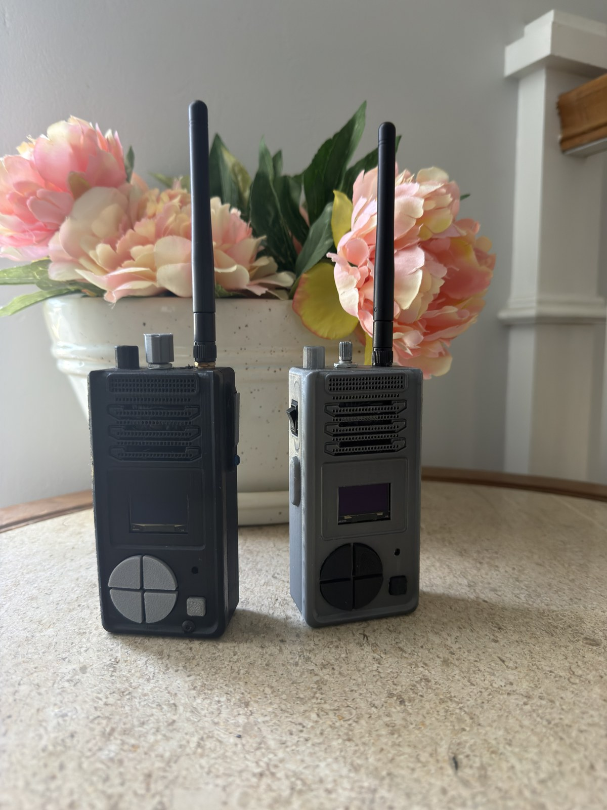
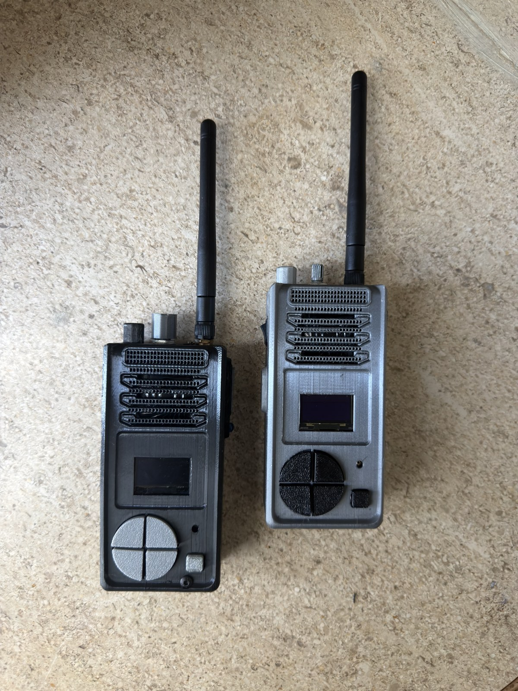
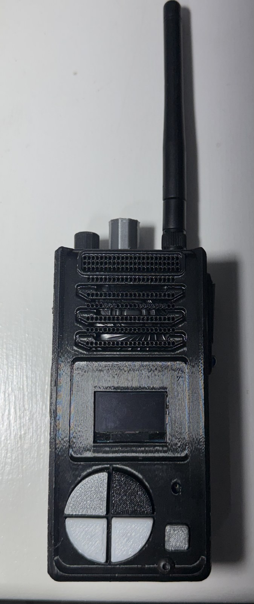
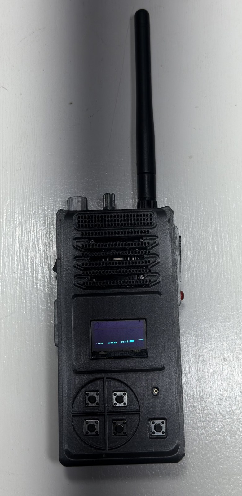
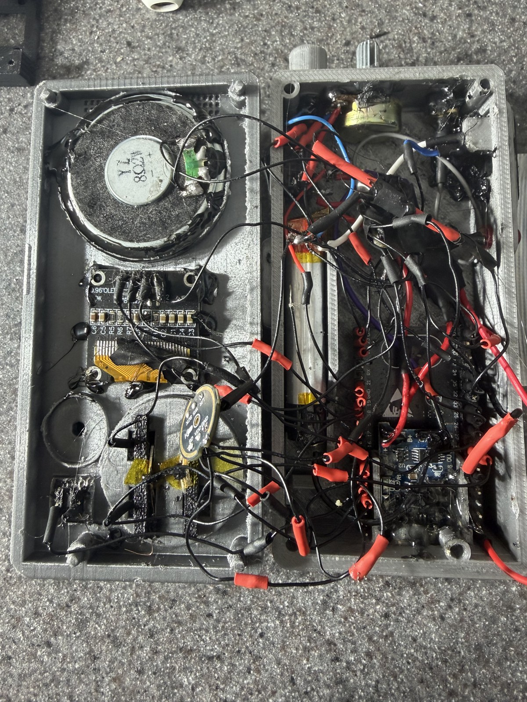
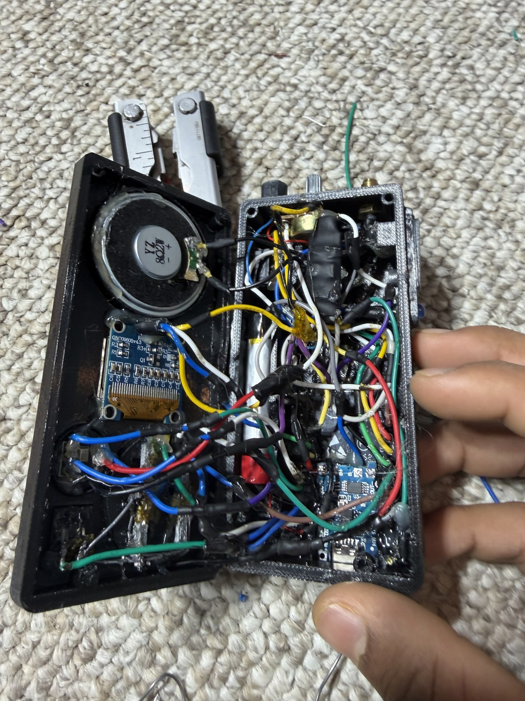

Source: 

<p align="center">
  
</p>


## Project Description

This is a ESP32 walkie talkie that uses WIFi (ESPNOW) for long range communication. It uses the esp32-wroom-32-U with an external U.fl connector, OLED 0.96 I2C display, I2S INMP441 microphone, I2S MAX98357A 3W speaker amplifier, 10k volume potentiometer, PTT button + 5 menu buttons, LASER, and LED. The aim of this walkie talkie was to not just serve as a walkie talkie, but sort of like a custom flipper zero that was more wireless oriented, although the walkie talkie comes with 3 female dupont pins that can be plugged in externally for a UART connection.

This device was framed as a walkie talkie but it can be used as a Wi-Fi/IoT device handheld controller platform. This is the main advantage with WIFI on esp32s as you can connect to a lot of places.


### Features

* Peer-to-peer ESP-NOW voice communications without any router or access point.
* ESP32 with external antenna hardware for better distance compared with boards with PCB antenna.
* Configuration of ESP-NOW radio for long distance use with maximal ESP32 TX power and ESP32 LR PHY peer rate settings.
* Designed for up to 1 mile distance in line-of-sight in outdoor conditions, actual distance will depend heavily on antenna placement, interference, obstacles, body shielding and battery voltage.
* 16 kHz mono voice capture with IMA ADPCM compression, so each 20 ms of voice is captured and compressed in one ESP-NOW packet.
* Packet jitter buffer and packet loss concealment to reduce jitters when packets are received unevenly.
* Weak link redundancy which duplicates packets at distance with bad range and de-duplicates received packets to make range testing easier.
* Inbuilt flash range telemetry with JSON data collection to log range test without computer attached in the field.
* OLED interface for channels, link, signal, battery, volume, RX/PTT status, application menu, settings, lights control and kid mode.
* Firmware, wiring information, build pictures and CAD documentation to fork and evolve this project.


<p align="center">
  
</p>

## Walkie Talkie Hardware

The enclosure was designed to have enough space to solder every wire, but a custom PCB version was also made.

<p align="center">
  
  
</p>

### Electronics

* ESP32-U type development board with 240 MHz CPU, 4 MB flash memory, ~512 KB of internal SRAM, Wi-Fi, Bluetooth hardware and external antenna connection.
* OLED display for full interface.
* I2S digital microphone for voice input.
* I2S output feeding MAX9875A type speaker amplifier.
* Speaker included in 3D-printed enclosure.
* Volume potentiometer.
* Reclaimed 3.85 V lithium battery pack with capacity of about 2000 mAh.
* 6 GPIO push buttons for PTT, OK button, navigation and applications/settings.
* LED light for status and TX indication.
* Laser module operated on 3.3 V as manual output and part of lights app.
* Voltage divider to feed ADC pin for battery voltage measurement.

## Assembly Process

### 1. Printed enclosure

The enclosure was printed from the following parts in [`SOURCE CAD/INDIVIDUAL STLS`](SOURCE%20CAD/INDIVIDUAL%20STLS):

* [`walkie_talkie_bottom_case.stl`](SOURCE%20CAD/INDIVIDUAL%20STLS/walkie_talkie_bottom_case.stl)
* [`walkie_talkie_top_cover.stl`](SOURCE%20CAD/INDIVIDUAL%20STLS/walkie_talkie_top_cover.stl)
* [`walkie_talkie_top_buttons_grid.stl`](SOURCE%20CAD/INDIVIDUAL%20STLS/walkie_talkie_top_buttons_grid.stl)
* [`walkie_talkie_OK_button.stl`](SOURCE%20CAD/INDIVIDUAL%20STLS/walkie_talkie_OK_button.stl)
* [`walkie_talkie_PTT_button.stl`](SOURCE%20CAD/INDIVIDUAL%20STLS/walkie_talkie_PTT_button.stl)
* [`walkie_talkie_PTT_button_insert.stl`](SOURCE%20CAD/INDIVIDUAL%20STLS/walkie_talkie_PTT_button_insert.stl)

The internal hardware consists of the ESP32-U board, external antenna, SSD1306 OLED, I2S microphone, MAX9875A-style amplifier, speaker, volume potentiometer, six pushbuttons, LED, 3.3 V laser, reclaimed 3.85 V battery, TP4056 charging/protection board, 5 V boost converter, power switch, battery-divider resistors, and 32 AWG signal wire.

The printed buttons, OLED, LED, laser, speaker, antenna, and circuit boards were fitted into their dedicated openings. The two USB-C openings align with the ESP32 programming connector and TP4056 charging connector.

### 2. Power system

The walkie uses the following self-contained battery-power circuit:

```text
3.85 V battery
      |
      v
TP4056 B+/B-
      |
TP4056 OUT+/OUT-
      |
Main power switch
      |
5 V boost converter
      |
ESP32 5V/VIN + amplifier power + OLED power rail
```

1. The reclaimed battery connects to TP4056 `B+` and `B-`.
2. TP4056 `OUT+` passes through the main power switch into the boost-converter positive input.
3. TP4056 `OUT-` connects directly to boost-converter ground.
4. The boost converter produces the 5.0 V system rail.
5. The regulated 5 V rail powers the ESP32 `5V`/`VIN` pin, speaker amplifier, and OLED. The ESP32, amplifier, OLED, microphone, LED, laser, potentiometer, and buttons share a common ground.
6. The battery-divider resistors connect the battery rail to GPIO35 and ground using the Black and Grey values in the pin-assignment table.
7. The TP4056 and power switch are glued into their printed mounts with their connectors aligned to the case openings. The battery press-fits into its printed compartment without adhesive.

### 3. Electronics wiring

The ESP32 and peripheral wiring was completed outside the enclosure while every solder pad remained accessible. This kept the finished harness organized inside the tight case.

Thin 32 AWG wire was cut to the final routed lengths for the signal connections. The electronics connect to the ESP32 as follows:

1. The SSD1306 OLED connects to GPIO18 SCL and GPIO19 SDA.
2. The I2S microphone connects to GPIO16 BCLK, GPIO17 WS, and GPIO4 SD. Its L/R selection pin is tied to ground for the left audio channel used by the firmware.
3. The speaker amplifier input connects to GPIO32 BCLK, GPIO33 WS/LRC, and GPIO25 DIN.
4. The speaker connects to the amplifier output terminals.
5. The volume potentiometer wiper connects to GPIO34, with its outer terminals on the analog reference rail and ground.
6. The OK button connects to GPIO0, the bottom-left button to GPIO14, and the bottom-right button to GPIO15. The opposite terminal of every button joins common ground.
7. The PTT, top-left, top-right, and LED connections follow the selected Black or Grey board profile.
8. The 3.3 V laser control connects to GPIO21.
9. The battery-divider midpoint connects to GPIO35.
10. A continuity test covered the microphone, amplifier, speaker, LED, laser, potentiometer, OLED, PTT button, OK button, and four navigation buttons.

### 4. Front-panel assembly

1. The LED and laser press into their printed holes.
2. The PTT, OK, and four navigation buttons sit in the front-panel openings.
3. A small amount of superglue around the outside of each loose button body holds it in place. Adhesive stays outside the moving mechanism; glue entering the mechanism locked a button during an earlier case iteration and required the front case to be reprinted.
4. The printed PTT insert and top button grid sit over their switches with free movement.
5. The OLED sits in the front opening, and the speaker sits behind its grille.

### 5. Internal packing

1. The completed wiring runs along the case walls with the audio, power, and signal bundles separated.
2. The ESP32 is pressed beneath the TP4056 mount until its USB-C programming port aligns with the lower case opening. The second opening aligns with the TP4056 charging port.
3. The amplifier, microphone, potentiometer, and remaining wiring occupy their printed spaces without loading the solder joints.
4. The U.FL antenna connects to the ESP32-U board, and its cable passes through the enclosure's antenna opening.
5. The top cover closes over the completed PTT, navigation buttons, potentiometer, speaker, microphone, OLED, LED, laser, power switch, programming port, and charging port.

The enclosure has very little unused space. The 32 AWG signal wiring keeps the harness compact enough to fit below the top cover.

### 6. ESP-IDF firmware loading

The firmware is a complete ESP-IDF project containing `CMakeLists.txt`, `sdkconfig.defaults`, `partitions.csv`, and the `main` component. The following commands were used to configure, compile, flash, and monitor each board.

1. ESP-IDF was installed and opened through its configured terminal.
2. The terminal was changed to the project directory:

   ```powershell
   cd C:\Users\rshan\Documents\GitHub\ESP32-ESPNOW-Walkie-Talkie
   ```

3. The target was set to ESP32:

   ```powershell
   idf.py set-target esp32
   ```

4. The project configuration was opened with:

   ```powershell
   idf.py menuconfig
   ```

5. **Walkie Talkie Configuration** selected the Black profile for the black unit and the Grey profile for the grey unit. Each profile retained its matching peer MAC address and RF channel.
6. The firmware was compiled with:

   ```powershell
   idf.py build
   ```

7. The ESP32 programming port was flashed and monitored through its Windows serial port:

   ```powershell
   idf.py flash monitor
   ```

8. `Ctrl+]` closed the serial monitor.
9. One ESP32 received the Black profile, and the second received the Grey profile.
10. Both completed walkies started on the same logical channel with working OLED startup, link status, PTT audio, speaker volume, buttons, LED, and laser functions.


## Circuit Diagram

The high-level circuit diagram illustrates connections between ESP32, display, I2S audio devices, buttons, analog input, LED, laser, and battery measurement circuit.

<p align="center">
  
</p>

### Common Pin Assignment

| Function             | ESP32 GPIO | Comments                  |
| -------------------- | ---------: | ------------------------- |
| OLED SCL             |     GPIO18 | I2C clock                 |
| OLED SDA             |     GPIO19 | I2C data                  |
| Speaker BCLK         |     GPIO32 | I2S output bit clock      |
| Speaker WS/LRC       |     GPIO33 | I2S output word select    |
| Speaker DIN          |     GPIO25 | I2S output data           |
| Microphone BCLK      |     GPIO16 | I2S input bit clock       |
| Microphone WS        |     GPIO17 | I2S input word select     |
| Microphone SD        |      GPIO4 | I2S input data            |
| OK button            |      GPIO0 | Active low                |
| Bottom-left button   |     GPIO14 | Active low                |
| Bottom-right button  |     GPIO15 | Active low                |
| Laser                |     GPIO21 | 3.3 V laser module output |
| Volume potentiometer |     GPIO34 | ADC input                 |
| Battery divider      |     GPIO35 | ADC input                 |

### Black & Grey Variants Pin Assignment

The two walkies are not exactly the same, so the firmware has board profiles in `menuconfig`.

| Function         | Black walkie | Grey walkie |
| ---------------- | -----------: | ----------: |
| PTT button       |       GPIO22 |      GPIO23 |
| LED output       |       GPIO23 |      GPIO22 |
| Top-left button  |       GPIO26 |       GPIO2 |
| Top-right button |        GPIO2 |      GPIO26 |
| Battery divider  |  100k / 100k | 220k / 220k |
| Default peer     |     Grey MAC |   Black MAC |

Default ESP-NOW peer MAC addresses:

* Black walkie: `A4:F0:0F:66:D2:D0`
* Grey walkie: `A4:F0:0F:67:BA:1C`

### RC Car Expansion Pins

Black walkie provides GPIO1 and GPIO3 for `RCAR` app:

| RC car signal                 | Black walkie GPIO | Comments                        |
| ----------------------------- | ----------------: | ------------------------------- |
| Left drivetrain servo signal  |  GPIO1 / UART0 TX | 50 Hz PWM signal in `RCAR` mode |
| Right drivetrain servo signal |  GPIO3 / UART0 RX | 50 Hz PWM signal in `RCAR` mode |


## Internal Build: Grey Walkie

<p align="center">
  
</p>


Compared to the first iteration, the grey version has better designed layout and less mechanical stress on thin soldering points.

In addition, clean wiring also helps with debugging of audio issues. Digital microphone, I2S audio devices, and Wi-Fi ESP32 burst are things that become really hard to debug when power, ground, and signal wiring are mixed up.

## Internal Build: Black Walkie

<p align="center">
  
</p>

The black walkie is the first version with ESP32. It works, but it has quite thick internal wiring and thus congestion inside the walkie housing which makes build difficult and harder to inspect.


## Project History

It took several iterations before coming up with this ESP32 + ESP-IDF walkie-talkie version.

Initially, it was planned to use Raspberry Pi Pico with an external NRF24L01 radio module. It was a good choice for learning purposes, but it quickly became clear that it won't work well for real voice audio. ESP32 has more straightforward I2S peripheral setup than Pico for this application and implementation of such via PIO on Pico is too complicated and requires more time. Also, NRF24L01 radio chip doesn't have good audio transport capability.

Then, ESP32 was chosen with external antenna. It helped a lot since ESP32 has good documentation, Wi-Fi hardware support, ESP-NOW, ESP-IDF tools, and standard I2S peripherals for both microphone and speaker. Transition from MicroPython to compiled ESP-IDF firmware also made system much faster and provided more flexibility over timing and buffer management.

## Range Testing and Field Diagnostics

 Once packets start to drop because the walkies are too far apart, the radio layer will duplicate every audio frame to try once again. Sequence numbers of duplicated frames match, hence the receiver will play only one copy, not both.

The receiver is able to detect missed sequence numbers of received packets. Very short intervals between missed frames result in packet loss concealment audio, hence fading the sound through the missing audio frames, not making any clicks or breaks. Longer intervals are audible, but at least they become measurable due to onboard logging.


## Firmware Features


* 20 logical walkie-talkie channels, selected from the main PTT screen;
* Push-to-talk ESP-NOW voice mode with channel-matched audio packets;
* Link detection through heartbeats and RSSI-based signal meter;
* Adaptive weak-link redundancy through duplicating every audio frame when link quality is low or unknown;
* Six physical buttons on each walkie: PTT, OK/select, top-left, top-right, bottom-left and bottom-right;
* Applications menu with `RCAR`, `BUTTON CTRL`, `LIGHTS` and `KID MODE`;
* `RCAR` application with black-walkie Web Server mode and grey-to-black Walkie controller mode;
* Settings menu with options to limit audio level, low-battery, speaker boost, mic boost, mic cut, flash usage, memory usage, CPU overlay;
* Settings rows to print firmware version and onboard log to USB;
* Light playground to try LED and 3.3 V laser module through strobe, target, rate, constant and preset modes;
* Kid mode which locks walkie to the only channel and can be exited with holding OK for 2 seconds.


### User Interface

* Main PTT screen with walkie name, battery symbol, voltage, channel number, link status, volume, laser status, signal meter, RX activity and PTT activity;
* Channel display in format `< CH XX >` to show that top-left/top-right button can change channels through 20 logical channels;
* Apps menu with functional applications: `RCAR`, `BUTTON CTRL`, `LIGHTS` and `KID MODE`;
* `RCAR` menu with `WEB SERVER` and `WALKIE` modes. In the Web Server mode, black walkie creates open Wi-Fi AP called `ESP32-Tank` and serves a joystick page at `http://192.168.4.1`. In Walkie mode, grey walkie controls left and right servos of black walkie over ESP-NOW.
* Settings page with audio limiting, low-battery limiting, speaker boost, mic boost, mic cut, flash usage, memory usage, CPU overlay, firmware version and log dumping;
* Lights app/light playground with strobe, target selection, rate, constant LED, constant 3.3 V laser and preset patterns;
* Kid mode locked to channel 1, can be exited with holding OK for 2 seconds.


<p align="center">
  
  
</p>

<p align="center">
  <em>Main PTT home screen with channel/link status, and channel scanning screen to find active peers.</em>
</p>

<p align="center">
  
  
</p>

<p align="center">
  <em>Settings page with mic sensitivity enabled, and light playground strobe screen for LED/laser effects.</em>
</p>


### Range Debug Logging

The firmware creates one JSON-line telemetry record each second. The record is printed over USB serial if present and also saved into an onboard flash log allowing to get the range-test data from a remote walkie.

The onboard log is kept inside the `fieldlog` partition of SPIFFS storage. There is space for `range.jsonl` and one rotated previous file providing roughly 512 KB of flash-based range telemetry storage.

Example record:

```json
{"event":"radio_stats","t_ms":123456,"board":"BLACK","ch":1,"ptt":false,"link":true,"rssi_dbm":-82,"quality_pct":21,"jitter_frames":3,"vol_pct":50,"tx_audio":0,"tx_audio_dup":0,"tx_ctrl":2,"tx_no_mem":0,"tx_fail":0,"rx_audio":48,"rx_audio_dup":7,"rx_audio_old":0,"rx_plc":2,"rx_ctrl":1,"rx_wrong_peer":0,"rx_bad_proto":0,"rx_wrong_channel":0}
```


### Audio Transport

The voice frames are sent over ESP-NOW as compressed voice.

* Microphone sample rate: 16 kHz mono;
* Frame duration: 20 ms;
* Samples per frame: 320;
* Compression algorithm: IMA ADPCM with 4 bits per sample;
* Payload size: 160 bytes per frame;
* The frame is transmitted in a single packet;
* Packet rate while PTT is pressed: 50 packets per second;
* Packets size: 171 bytes;

Fields of audio packet:

| Field         | Size | Description                  |
| ------------- | ---: | ---------------------------- |
| Packet type   |    1 | `0xA1` for audio             |
| Proto ver.    |    1 | Protocol version of firmware |
| Logical ch.   |    1 | 1 to 20 software channels    |
| Flags         |    1 | Kid-mode/audio flag          |
| Sequence      |    2 | Detects ordering and loss    |
| ADPCM pred.   |    2 | Decoder state of the frame   |
| ADPCM step    |    1 | Decoder state of step size   |
| Sample cnt.   |    2 | Usually 320                  |
| ADPCM payload |  160 | Compressed voice samples     |

Types of control packets:

| Packet        |  Value | Description        |
| ------------- | -----: | ------------------ |
| Audio         | `0xA1` | Compressed voice   |
| Heartbeat     | `0xB1` | Link detection     |
| Scan request  | `0xB2` | Channel scan       |
| Scan response | `0xB3` | Channel scan reply |

### Audio Cleanup

There is multiple processing steps inside the firmware in order to make ESP-NOW voice more comprehensible:

* I2S microphone captures use the left channel since microphone L/R pin is tied to ground;
* Mic warmup discards the first frames after PTT press making the start of the transmission less noisy;
* High pass filter reduces DC offset and low-frequency rumble;
* Noise floor tracking helps distinguishing quiet background from voice;
* Gentle speech gating makes the background less noisy without fully cutting quiet speech;
* Different mic gain profiles for black and grey board to compensate for their different microphone behaviour;
* Speaker boost and mic boost settings adjust fixed-point gain inside the firmware;
* Receive jitter buffer to smooth out the arrival of packets;
* Packet loss concealment to fill short silence periods due to the missed packet.

## Code Structure

| Path                     | Description                                                                                                                                                                             |
| ------------------------ | --------------------------------------------------------------------------------------------------------------------------------------------------------------------------------------- |
| `main/main.c`            | Main application, board select, GPIO, ADC, I2S setup, ESP-NOW, RC car PWM/web/control mode, FreeRTOS tasks, buttons, menus, display, heartbeat, scan, capture, playback, resource stats |
| `main/walkie_audio.c`    | Microphone cleanup, gain, ADPCM encode/decode, playback scaling, packet loss concealment helpers                                                                                        |
| `main/walkie_audio.h`    | Audio API common between main application and walkie_audio code                                                                                                                         |
| `main/walkie_display.c`  | SSD1306 OLED display driver, framebuffer rendering, fonts and all screens                                                                                                               |
| `main/walkie_display.h`  | Display API                                                                                                                                                                             |
| `main/walkie_types.h`    | Common board/UI/RC car/settings/lights/snaphot structures                                                                                                                               |
| `main/Kconfig.projbuild` | Menuconfig options for black/grey board profiles, MAC addresses, RF channel                                                                                                             |
| `BOM.csv`                | Bill of materials for both walkie-talkie units                                                                                                                                          |
| `partitions.csv`         | Custom partition table with app and fieldlog partitions                                                                                                                                 |
| `sdkconfig.defaults`     | Default ESP-IDF project settings                                                                                                                                                        |
| `CMakeLists.txt`         | Project definition of ESP-IDF                                                                                                                                                           |

## Bill of Materials

This table matches [BOM.csv](BOM.csv). Prices are AliExpress USD prices checked July 23, 2026, exclude shipping and tax, and may vary by option, account, and region. Multipack rows show the cost for the quantity used by this build. The enclosure price is a solid-volume estimate derived from the checked-in STL geometry using a PLA density of 1.24 g/cm³ and filament priced at $10.14/kg; normal infill can cost less.

| Category | Quantity | Part | Link | Price |
|---|---:|---|---|---:|
| Fabricated | 2 sets | Walkie-talkie enclosure | [PLA filament](https://www.aliexpress.us/item/3256806989098121.html) | $2.22 estimated (219 g solid PLA) |
| Electronics | 2 | ESP32 development board | [AliExpress](https://www.aliexpress.us/item/3256807617923920.html) | $1.90 used (2 at $0.95 each) |
| Radio | 2 | External antenna | [AliExpress](https://www.aliexpress.us/item/3256812004598286.html) | $0.64 used (2 of 10-pack at $3.21) |
| Display | 2 | OLED display | [AliExpress](https://www.aliexpress.us/item/3256805954920554.html) | $1.98 used (2 at $0.99 each) |
| Audio | 2 | I2S microphone | [AliExpress](https://www.aliexpress.us/item/3256810210666726.html) | $6.45 (2-pack) |
| Audio | 2 | I2S speaker amplifier | [AliExpress](https://www.aliexpress.us/item/3256809715431644.html) | $1.88 used (2 at $0.94 each) |
| Audio | 2 | Speaker | [AliExpress](https://www.aliexpress.us/item/3256805151989671.html) | $0.99 (2-pack) |
| Control | 2 | Volume potentiometer | [AliExpress](https://www.aliexpress.us/item/3256805703535495.html) | $0.99 (2-pack) |
| Power | 2 | Lithium battery | [AliExpress](https://www.aliexpress.us/item/3256811489152615.html) | $10.96 used (2 at $5.48 each) |
| Power | 2 | Battery charger and protection board | [AliExpress](https://www.aliexpress.us/item/3256809139500038.html) | $0.20 used (2 of 10-pack at $0.99) |
| Power | 2 | Boost converter | [AliExpress](https://www.aliexpress.us/item/3256811757076890.html) | $1.88 used (2 at $0.94 each) |
| Power | 2 | Main power switch | [AliExpress](https://www.aliexpress.us/item/3256809823421130.html) | $2.37 (2-pack) |
| Lighting | 2 | Status LED | [AliExpress](https://www.aliexpress.us/item/3256807537207911.html) | $0.02 used (2 of 100-pack at $1.22) |
| Lighting | 2 | Laser module | [AliExpress](https://www.aliexpress.us/item/3256808318801769.html) | $0.99 (2-pack) |
| Control | 12 | Momentary pushbutton | [AliExpress](https://www.aliexpress.us/item/3256810479380665.html) | $0.99 (24-switch kit) |
| Optional RC | 2 | Continuous-rotation servo | [AliExpress](https://www.aliexpress.us/item/3256804365417662.html) | $9.28 (2-pack) |
| Measurement | 2 | 100-kilohm battery-divider resistor | [AliExpress](https://www.aliexpress.us/item/3256802303553096.html) | $0.02 used (2 of 100-pack at $0.90) |
| Measurement | 2 | 220-kilohm battery-divider resistor | [AliExpress](https://www.aliexpress.us/item/3256802303553096.html) | $0.02 used (2 of 100-pack at $0.90) |
| Wiring | 1 set | Signal and power wire | [AliExpress](https://www.aliexpress.us/item/3256810394181790.html) | $0.99 allowance |
| Consumable | 1 set | Insulation materials | [AliExpress](https://www.aliexpress.us/item/3256810151179232.html) | $0.99 allowance |
| Consumable | 1 set | Assembly supplies | [AliExpress](https://www.aliexpress.us/item/3256812225038383.html) | $0.99 allowance |
| Optional fabricated | As needed | Brackets and mounts | [PLA filament](https://www.aliexpress.us/item/3256806989098121.html) | $10.14 allowance (1 kg PLA spool) |


